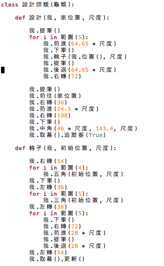
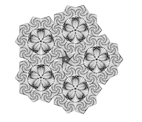
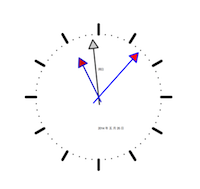
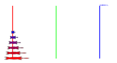

pythonTurtleInChinese
=====================

Python turtle graphics translated into Chinese characters, using Python 3

[turtle_tc.py](./turtle_tc.py)

Renyuan Lyu  
2014/05/25

[renyuan.lyu@gmail.com](mailto:renyuan.lyu@gmail.com)

[http://google.com/+RenyuanLyu](http://google.com/+RenyuanLyu)

 
 

  

(A screenshot showing an excerpt from the `ryBytedesign.py` script)

 
 

Inspired by the MIT Scratch project, 
a program language capable of supporting programmers' native languages,  
will make possible more people (particularly non-English-speaking kids) 
able to write the program more fluently.

Starting from Python version 3.0,  the Python scripts are encoded in utf-8.

In another words, except for the 30+ keywords, 
all the names of variables, functions, methods, and classes 
can not necessarily be ASCII code, nor pure English.

That is to say, programmers can write programs in their own **native languages**.

I think this will be a key point to make Python overspread even broader.

As long as we can dive into many python's modules, 
provide a set of name aliases for each class, method, and some global variables, 
then kids or naive people can also write their own programs. 

Kids include those from K to 12 in non-English-speaking countries, 
who are neither fluent nor confident in English. 

This program/module (turtle_tc.py) implementing the above idea is one of the few first tries,
it is an appendix to the Python built-in modules `turtle.py`. 

It is majorly a bunch of traditional Chinese alias of English name.

It is named as `turtle_tc.py`, to emphasize it is majorly in traditional Chinese.

Similar modification can be made in any other non-English language. 

This file can be run by itself,   
it can also be put in the path of Python library or simply in the current directory,   
and be imported by the other application of turtle programs.

To use Chinese names could not only make the program more readable for local Chinese speaking programmers, 
it could also make the program more compact, dense and beautiful.

Just as Python's zen says, "Readability Counts".

My interpretation is that it DOES HELP readability in programmers' native languages, 
if the major audience of the program is those people with the same native languages.

Renyuan Lyu
2014/05/24
 
 

### Examples

|                                                      |                                                  |
|------------------------------------------------------|--------------------------------------------------|
|          |                |
| `./examples_tc/ryBytedesign.py`                         | `./examples_tc/ryClock.py`                          |
|    |    |
| `./examples_tc/ryMinimal_hanoi.py`                      | `./examples_tc/ryTdemo_teddy.py`                    |
|                |  |
| `./examples_tc/ryYinyang.py`                      |  |

### an experimental documenting system

  

(A screenshot showing help on a chinese name of function 前進 in Python IDLE)

============================
用 Python 3，學中文程式設計。
============================

繁體中文龜
----------

使用這個模組，可以讓你使用繁體中文來控制龜畫圖。

作者：呂仁園。
-------------

受了 MIT Scratch project 的啟發，
讓 programming language 能夠以程式員的母語來表達，
將是讓更多人(特別是非英語為母語的小孩)能夠來寫程式的一個關鍵要素。

Python 3.0 以後， 變數、函數、以及物類名稱都使用  Utf-8 編碼，
允許 程式員 運用 其母語來寫作程式，
只要我們鑽進眾多模組內部，為每個物類的函數名稱給個母語別名，
再把相應的 doc 文件說明也轉成母語，
這個基本工程將建立起母語寫作程式的基礎環境，
程式教育就有可能向下紮根，到達高中，甚至是國中的階段。

本程式模組就是在這個想法之下的首次嘗試，
我們把 Python 中， 一個頗負盛名的模組，turtle.py，
為其提供一個繁體中文 (traditional Chinese) 的附加模組，
命名為 turtle_tc.py，

使用者只要把本程式模組放在 python環境下，模組的搜尋路徑內，
一般為當前程式碼的目錄 (current dir)或是 C:/Python3.x/Lib/，
那麼，你就可以用
import turtle_tc
來取代
import turtle

進而，運用中文來寫基於 龜 的作圖程式，就成為可能。

安裝之法：
下載本模組並解壓縮後，在本模組所在目錄下，
執行 

python setup.py install
-----------------------

即可，
注意： 本模組僅在 python 3.x 的環境下運作。

測試安裝成功與否：在 python 提示號 >>>之下，打入以下指令。

>>> import turtle_tc

>>> turtle_tc.demo()

即可看到 龜 畫太極圖。
